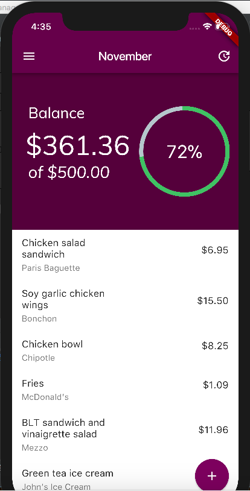
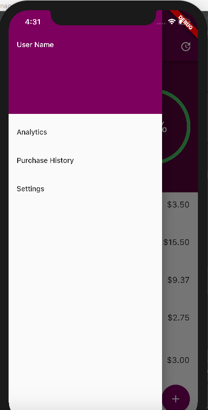
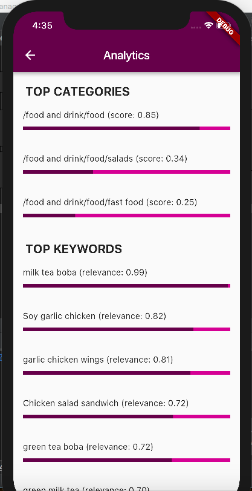

# expense_manager

Minimalist, easy-to-use expense tracker for college students featuring an analytics page powered by IBM Watson's natural language understanding API. Informs users of their top categories (probably food!) and top keywords (probably boba!), so they know what types of purchases they're making. Cross-platform mobile application built in the Google Flutter framework for Dart.

## Screenshots

  
